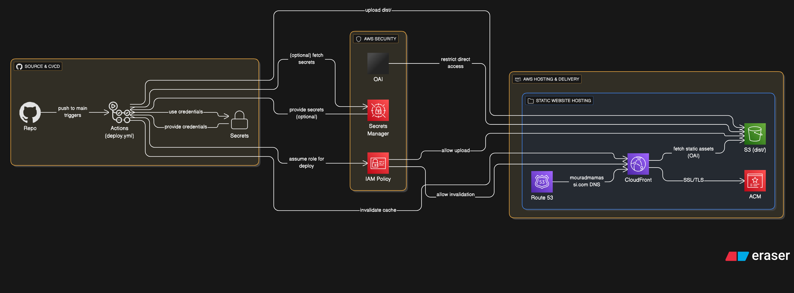

Mon Portfolio Personnel
=======================

Bienvenue sur le dépôt GitHub de mon portfolio personnel, un projet qui met en lumière mon expertise en tant que Tech Lead et Ingénieur Logiciel. Ce site web statique, conçu avec React, est déployé sur une architecture AWS moderne et sécurisée via un pipeline CI/CD automatisé avec GitHub Actions.

🚀 Vue d'ensemble du projet
---------------------------

Ce projet est un portfolio web qui présente mes réalisations professionnelles, mes compétences techniques, mes certifications et mon parcours académique. Il est conçu pour être à la fois performant, sécurisé et facile à maintenir.

🏗️ Architecture et Technologies
--------------------------------

L'infrastructure du site est entièrement hébergée sur AWS en utilisant une approche "serverless" et des services gérés pour garantir scalabilité, performance et fiabilité.

### Composants Clés

*   **Application Frontend (React)**: Le site est une application React.js. Les composants clés comme PortfolioSection.jsx, SkillsSection.jsx et CertificationsSection.jsx permettent de structurer et de présenter l'information de manière claire et responsive. L'application est compilée en un site web statique optimisé.
    
*   **Stockage (Amazon S3)**: Le site statique est stocké dans un bucket S3, qui sert d'origine pour notre CDN. Une configuration de sécurité stricte assure que le contenu ne peut être accédé directement que par CloudFront.
    
*   **Réseau de distribution de contenu (AWS CloudFront)**: CloudFront met en cache le site web dans ses "edge locations" à travers le monde. Cela réduit la latence et améliore considérablement les temps de chargement pour les utilisateurs, où qu'ils soient.
    
*   **Gestion des domaines (AWS Route 53)**: Ce service DNS a été utilisé pour gérer le domaine personnalisé mouradmamassi.com, en pointant les enregistrements A et CNAME vers la distribution CloudFront.
    
*   **Sécurité (AWS Certificate Manager - ACM)**: Un certificat SSL/TLS a été provisionné avec ACM pour activer le protocole HTTPS, garantissant que toutes les communications entre les utilisateurs et le site sont chiffrées et sécurisées.
    
*   **Sécurisation de l'origine (CloudFront Origin Access Identity - OAI)**: Pour une sécurité maximale, nous avons utilisé un OAI pour restreindre l'accès au bucket S3. Seul CloudFront peut lire le contenu du bucket, bloquant ainsi toute tentative d'accès direct.
    

⚙️ Automatisation : Le pipeline CI/CD
-------------------------------------

Le déploiement de ce portfolio est entièrement automatisé grâce à un pipeline de CI/CD mis en place avec **GitHub Actions**.

Le fichier deploy.yml définit un workflow qui se déclenche à chaque push sur la branche main. Ce processus automatisé inclut les étapes suivantes :

1.  **Compilation du projet**: Le code React est compilé pour créer les fichiers statiques optimisés dans le dossier dist/.
    
2.  **Déploiement sur S3**: Les fichiers compilés sont automatiquement uploadés sur le bucket S3.
    
3.  **Invalidation du cache CloudFront**: Le cache de la distribution CloudFront est invalidé, forçant les serveurs du CDN à récupérer la dernière version du site depuis le bucket S3.
    

Les informations sensibles, comme les identifiants AWS et l'ID de distribution CloudFront, sont stockées en toute sécurité en tant que **GitHub Secrets**, garantissant que le pipeline peut opérer sans exposer de données critiques. Une politique **IAM** a été configurée pour octroyer les permissions minimales nécessaires au workflow.

Ce projet illustre l'application concrète de l'ingénierie logicielle moderne : de la conception d'une application frontend à la mise en place d'une architecture cloud robuste et d'un processus de déploiement entièrement automatisé.

